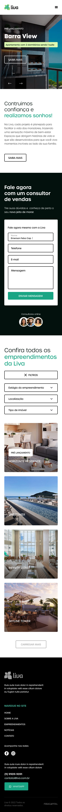
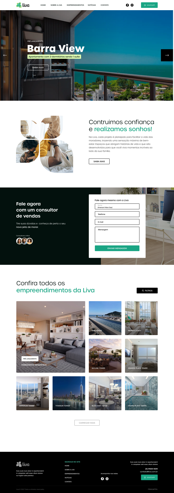

# Liva Landing Page

This project is a landing page built with [Next.js](https://nextjs.org/) and [React](https://react.dev/), focused on responsiveness, SEO, UI best practices, and form validation.

## About the project

The landing page presents institutional information, project sections, and a contact form. The goal is to provide a modern and efficient experience for visitors and potential clients.

## Design inspiration

This landing page was inspired by a Figma design.  




### Main technologies used

- **CSS Modules**: For modular component styling without scope conflicts.
- **React Hook Form** + **Yup**: For managing and validating contact form data, ensuring clear feedback and input rules.

## How to run the project

1. **Install dependencies**:
   ```sh
   npm install
   ```
2. **Start the development server**:
   ```sh
   npm run dev
   ```
3. Open [http://localhost:3000](http://localhost:3000) in your browser.

## Project structure

- Source code in [`src/`](src/)
- Reusable components in [`src/app/components/`](src/app/components/)
- Contact form implemented in [`src/app/(sections)/Contact/components/Form/Form.tsx`](<src/app/(sections)/Contact/components/Form/Form.tsx>) using [`react-hook-form`](https://react-hook-form.com/) and [`yup`](https://github.com/jquense/yup).
- Form styles in [`src/app/(sections)/Contact/components/Form/Form.module.css`](<src/app/(sections)/Contact/components/Form/Form.module.css>)

## Form validation

Contact form fields are validated with [`yup`](https://github.com/jquense/yup), integrated with [`react-hook-form`](https://react-hook-form.com/), ensuring submitted data is correct and complete.

## Useful scripts

- `npm run dev`: Starts the development environment.
- `npm run build`: Generates the production build.
- `npm run start`: Starts the server in production mode.
